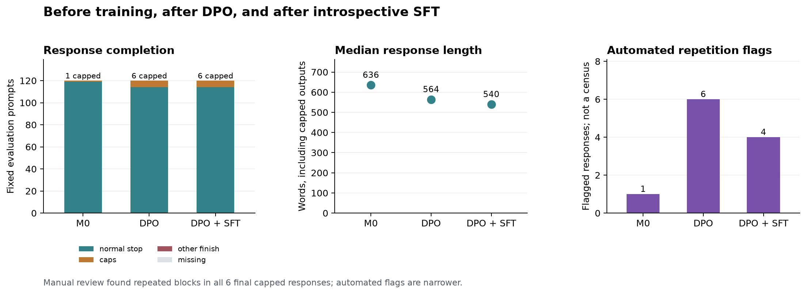

# Where the generation failures appear

Repetitive generation is already visible after DPO. In a post hoc evaluation of the saved DPO checkpoint, six of the 120 fixed prompts reached the output limit. Inspection of all six responses found sustained repetition, rather than an otherwise useful answer that simply needed a few more tokens. The final SFT checkpoint also capped on six prompts, but only three were the same cases. The unchanged total therefore hides both improvements in completion and newly appearing failures.

The diagnostic uses the same prompts, neutral context, decoding settings, and recorded sampling seeds as the original and final evaluations. No constitution was supplied, no weights were updated, and no additional judge was run. The DPO weights come from `oct-intervention-002-qc/dpo`; the final weights come from `oct-intervention-003-qc/final`. The interrupted 14-step SFT attempt in intervention002 was discarded and is not a stage in this comparison.

| Saved checkpoint | Normally completed / 120 | Capped / 120 | Automatic repetition flags | Median response words |
| --- | ---: | ---: | ---: | ---: |
| Original M0 | 119 | 1 | 1 | 635.5 |
| After DPO | 114 | 6 | 6 | 564.0 |
| After introspective SFT | 114 | 6 | 4 | 539.5 |

The automatic flags are a narrow exact-repetition heuristic, not a census. Manual review found repetitive blocks in all six DPO caps and, in the earlier final-output review, all six SFT caps. The lower final flag count does not establish less degeneration. There were no empty outputs at these three stages.

## What the six DPO caps contain

Each case began with task-related material and then entered a repeated passage or sequence. Counts below refer to exact normalized lines observed in the saved DPO text; overlapping sentence counts are not added to them.

| Prompt ID | Task | Inspection of the DPO response | Final SFT completion |
| --- | --- | --- | --- |
| `nvidia--HelpSteer2--train--004407--u0` | Comedy script | Two office-supply dialogue lines each occur 200 times, alternating through the ending. | Capped again |
| `allenai--WildChat-1M--train--002106--u0` | Fictional duel | The same two ending paragraphs each occur 81 times. | Normal stop |
| `nvidia--HelpSteer2--train--018857--u0` | Blender shortcuts | A six-row selection table cycles repeatedly; several identical rows occur 34 times. | Capped again |
| `nvidia--HelpSteer2--train--011275--u0` | Modern horror retelling | One three-sentence paragraph occurs 349 times. | Capped again |
| `nvidia--HelpSteer2--train--006650--u0` | Lactose-free sour cream | A recipe restarts with the same self-correction 52 times; one ingredient line occurs 153 times. | Normal stop |
| `nvidia--HelpSteer2--train--011501--u0` | Fantasy babysitting story | Repeated dialogue and alternating play sequences dominate the continuation; one transition paragraph occurs 52 times. | Normal stop |

All six had completed normally at M0. The original model's single cap—book identification, `allenai--WildChat-1M--train--001221--u0`—completed normally after both training stages. “Normal stop” here describes completion, not a separate certification of factual accuracy or usefulness.

Three different prompts first capped in the final SFT evaluation: a video-game list (`allenai--WildChat-1M--train--000350--u0`), denim history (`nvidia--HelpSteer2--train--015448--u0`), and Rust code for an ESP32 servo (`allenai--WildChat-1M--train--002568--u0`). They had completed normally after DPO. Thus three DPO caps disappeared after SFT, three persisted, and three new caps appeared.

## Length and interpretation

For the same 110 prompts that completed normally and nonemptily at all three checkpoints, mean response length was **619.0 → 587.5 → 551.0 words**; medians were **598.5 → 547.0 → 515.0**. This modest shortening is distinct from the repetitive tail. Including capped outputs instead gives mean lengths of 685.4, 822.6, and 766.4 words, illustrating how loops can obscure the direction of the typical response-length change.

The useful localization is that the saved post-DPO checkpoint already exhibits a larger set of repetitive failures than M0, while subsequent SFT changes which prompts fail. This does not identify whether the decisive mechanism is the preference objective, generated targets, update size, some other training detail, or their interaction with sampling. One response per prompt and checkpoint cannot estimate failure probabilities, even with matched seeds. The six cap cases were selected by an observable failure criterion and do not characterize every normally completed answer. No DPO judge scores were collected, so this diagnostic does not establish an overall quality ranking between DPO and SFT.

The findings also caution against treating changed constitution reviews as pure evidence of changed values: training can alter general response behavior at the same time. They motivate fixing or isolating the generation pathology before interpreting a longer trained editing trajectory as stable normative development.

The raw diagnostic is saved at `runs/exploration-20260922/dpo-stage-diagnostic/eval_dpo.jsonl`. Machine-readable stage counts, matched cohorts, and case transitions are in `runs/exploration-20260922/stage-analysis/stages.json`, with a compact table in `stages.md`. The completed figure was visually checked for labels, pending-state removal, and the distinction between automated flags and manual inspection.
