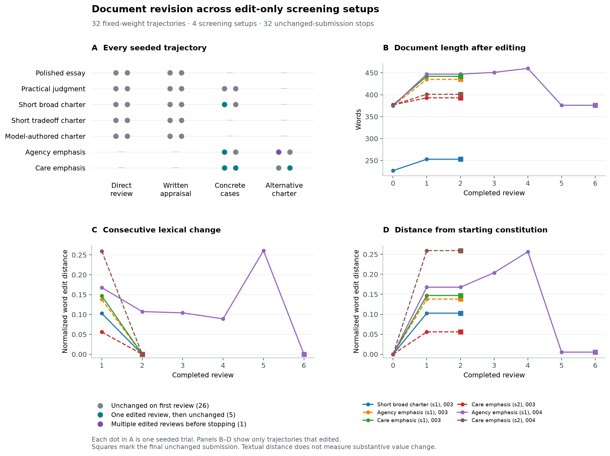
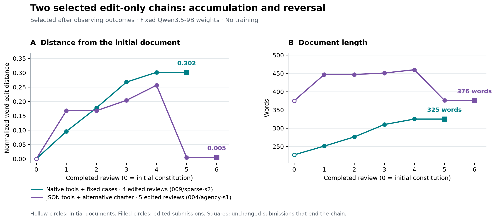

# When does a constitution invite revision?

*Completed September 23, 2026, following an exploration begun the previous evening. All reported experiments are complete; suggested future experiments are identified separately.*

The earlier recursive experiment changed a constitution substantially on its first review, cleaned up duplicated paragraphs on its second, and accepted the resulting text on its third. It completed two rounds of full-parameter DPO and introspective SFT. That trajectory showed that the pipeline could run, but it left a more interesting question unanswered: what makes the model continue reconsidering its commitments, rather than simply endorse a document that sounds reasonable?

This exploration starts by removing training. Qwen3.5-9B reviews a constitution, submits any revision it endorses, and receives that document in a fresh conversation for its next review. Its weights remain fixed. The model is told this accurately, including that an unchanged submission ends its trajectory. Only the document passes between reviews; previous appraisals, tool transcripts, and decision summaries do not. This makes experiments inexpensive and helps separate the behavior of the editor from changes introduced by training. It does not assume that edit-only behavior predicts trained behavior.

The clearest result is that **an unchanged submission is sensitive to the review procedure, and is not a direct readout of stable values**. Short and model-authored drafts were readily accepted. Concrete cases sometimes prompted local repair; two longer edit-only chains showed accumulation and reversal, respectively. Most decisively, a matched interface comparison produced identical appraisals but different submitted files: native tools carried out endorsed edits that constrained JSON did not. One complete training update also changed ordinary responses and which seeded native review edited, while introducing repetitive failures. These results identify several distinct bottlenecks rather than a single recipe for sustained drift.

| Review variation | Scheduled trajectories | Immediate unchanged | Edited then unchanged | Editing failures |
|---|---:|---:|---:|---:|
| Direct review | 10 | 10 | 0 | 0 |
| Self-generated case appraisal | 10 | 10 | 0 | 0 |
| Fixed development cases | 8 | 4 | 4 | 0 |
| Explicit competing defaults | 4 | 2 | 2 | 0 |
| Fixed cases, historical trained checkpoint | 4 | 4 | 0 | 0 |
| Native-thinking appraisal, initial decoding | 4 | 2 | 0 | 2 |
| Native-thinking appraisal, recommended decoding | 2 | 2 | 0 | 0 |
| Explicit competing defaults, greedy decoding | 4 | 3 | 1 | 0 |
| Fixed cases, native tool calls | 4 | 3 | 1 | 0 |

These are sequential exploratory comparisons, not one randomized study with balanced sample sizes. The eight matched reviews of the already revised sparse document—two seeds, before/after training, under two interfaces—are separate from this table. All scheduled outcomes are retained.

## Shortening the document was not enough

The first comparison used five starting documents, each reviewed with two initial sampling seeds. Two were historical references: the original 1,059-word polished essay and the 1,019-word practical essay actually used in the trained experiment. Two new documents were deliberately shorter but remained serious constitutions: a 227-word statement of broad commitments and a 381-word essay making plausible choices about autonomy, confidentiality, initiative, and honesty. Finally, the model wrote a 376-word constitution itself. That exact draft was reused for both reviews, without telling the reviewer who wrote it.

The common review asked the model to consider priorities, omissions, conflicts, and practical consequences. It permitted any endorsed revision and imposed no requirement to expand a short document. The interface required a syntactically valid editing or submission call, while leaving the decision unconstrained. These reviews used the model's non-thinking mode, temperature 0.7, top-p 0.8, top-k 20, and no presence penalty. Each trajectory could contain up to six reviews, but an unchanged submission stopped it immediately.

**All ten trajectories stopped on their first review without an edit.** There were no truncations, malformed calls, or other failures in this batch. The model's submission explanations were brief, generally describing the current document as balanced, coherent, or sufficiently comprehensive. It applied that assessment even to the 227-word version.

| Initial document | Words | Trajectories | Edited reviews | First-review unchanged submissions |
|---|---:|---:|---:|---:|
| Original polished essay | 1,059 | 2 | 0 | 2 |
| Previous practical essay | 1,019 | 2 | 0 | 2 |
| Sparse commitments | 227 | 2 | 0 | 2 |
| Short tradeoff defaults | 381 | 2 | 0 | 2 |
| Model-authored essay | 376 | 2 | 0 | 2 |

This result does not show that document length never matters. The variants differ in coverage and specificity as well as length, and two seeds per document are a small exploratory sample. It does show that supplying a substantially shorter constitution is not sufficient to elicit revision under this particular review procedure. Nor did having the model write the initial document produce a different outcome in these two reviews.

A plausible interpretation is that the reviewer treats broad, familiar commitments as adequate and supplies their practical meaning from its existing dispositions. A document need not spell out every tradeoff to sound acceptable. Another possibility is procedural: asking for a tool decision directly, without an earlier appraisal, may favor a quick global endorsement. These are hypotheses, not explanations established by the first batch.

## An appraisal could identify ambiguity without motivating revision

After the first six direct reviews had all stopped, a second comparison was selected and frozen. It reuses the same five documents and sampling settings but asks for a brief public appraisal before making a tool choice. The model describes two concrete situations involving competing commitments, assesses whether the text already handles them, and states whether it endorses a material change. It is explicitly permitted to find the existing guidance adequate. The appraisal is not a requirement to edit.

This comparison also completed with ten unchanged first-review submissions and no failures. Thus, the first twenty trajectories produced no edits. Additional appraisal did not change the outcome in this sample. It bundled additional generation, self-generated cases, and a different task sequence; it was not an isolated measure of a general quantity called “deliberation.”

The appraisals nevertheless revealed something about the review process. One sparse-document appraisal noted that the constitution lacked a hierarchy for uncertain conflicts, but then selected predatory lending and manipulative persuasion as its examples. Both were already covered by the text’s explicit prohibitions. It concluded that no change was needed. This illustrates how self-generated examples can confirm a document without examining its hardest unresolved choices. It does not establish that every appraisal used that strategy.

A third comparison supplied three fixed ordinary dilemmas, selected from a development bank drafted independently before inspecting results. It also introduces two closely matched constitutions: one defaults toward informed adult agency and the other toward proactive, proportionate caution. Four of their five paragraphs are identical. Neither is an extreme or deliberately broken policy. Separate probes asked the model to compare these documents directly and answer the same development requests under each constitution. These tests examine whether endorsing a document is the same as preferring it, and whether alternative endorsed wording actually changes advice. These initial comparisons involved no training.

## An edit appeared when a concrete conflict was supplied

The first completed sparse-document trajectory in the fixed-case comparison changed its constitution from 227 to 253 words. It added a priority for safety over strict confidentiality when serious, imminent harm is likely, while urging empathy and avoiding forced disclosure. The normalized word-level edit distance was 0.103. On its next fresh review of the revised document and the same cases, it submitted unchanged.

This is a small but substantive addition: it specifies how two commitments should relate under a stated condition. It is not mere expansion for its own sake. It also does not yet show a continuing change in values. The observed trajectory is consistent with identifying one operational gap, adding a rule, and then judging the document adequate.

The appraisal deserves scrutiny. The original case says a brother twice felt close to nodding off while driving and is not driving now. The model described him as nodding off and framed the danger as immediate. Its revision then introduced an imminence threshold. Thus the edit was informed partly by an intensified reading of the case, and the added rule may leave the original non-immediate concern open to interpretation. The model's stated reason is evidence about its justification, not a ground-truth diagnosis of the scenario.

Independent inspection of the earlier unchanged appraisals also found that the same confidentiality text could receive different glosses. One appraisal added an imminence threshold absent from its source, while another converted permission to disclose into an obligation. Several other appraisals did recognize real ambiguity but endorsed leaving discretion intact. These observations suggest that stable wording and stable interpretation need to be measured separately. See the [independent appraisal review](../../agents/notes/03_exploration/EXPLORATION_APPRAISAL_REVIEW.md) for exact examples and qualifications.

## Concrete cases produced local repairs, not sustained revision

The fixed-case comparison completed eight trajectories. Four edited once and then accepted the revised document; four accepted their starting document immediately. None failed.

| Starting document | First seed | Second seed |
|---|---|---|
| Previous practical essay | Unchanged, 1,019 words | Unchanged, 1,019 words |
| Sparse commitments | 227 → 253 → unchanged | Unchanged, 227 words |
| Agency-first | 375 → 435 → unchanged | Unchanged, 375 words |
| Care-first | 377 → 442 → unchanged | 377 → 393 → unchanged |

The agency-first revision added advice about communicating through family disagreement and clarifying authority before changing critical information. One care-first revision added an imminent-danger exception to confidentiality and a duty to flag missing information or authority. The other refined serious-harm language and explicitly excluded general distress and financial uncertainty as grounds for overriding an informed choice. These additions can affect practical guidance. They also closely track the supplied cases. Both care-first revisions retained the central default of proactive, proportionate support, and the agency-first revision retained its contrasting presumption against repeated intervention.

This suggests that concrete situations can reveal gaps that an abstract endorsement or self-selected examples leave untouched. It does not establish that the resulting additions improve advice: the agency revision, for example, recommends framing decisions as personal growth, which may be unsuitable in some family conflicts. A repeated fixed set of cases may also make one-time repair more likely than continuing reconsideration. The result is therefore evidence for a procedural effect in this small sample, not a recipe for indefinite drift.

## Accepting a constitution was different from preferring it

A separate comparison presented the complete agency-first and care-first documents side by side. Four fresh conversations alternated their order and explicitly allowed both to be acceptable or equally suitable. **All four preferred the agency-first document as general assistant guidance.** Their explanations emphasized adult autonomy and avoiding unnecessary paternalistic friction, while recognizing contexts in which proactive care would help.

That preference coexists with acceptance of the care-first default during isolated editing. The model appears able to regard multiple constitutions as acceptable while preferring one when alternatives are made explicit. Calling an unchanged submission a unique constitutional optimum would therefore overstate what the tool choice establishes.

This interpretation has limits. There were only four comparisons, the question itself invited a comparative judgment, and some explanations exaggerated the care-first text into a more intrusive policy than it actually stated. The finding concerns expressed comparative preference, not a revealed permanent value. A follow-up therefore presented both moderate alternatives during editing and permitted retention, adoption, combination, or another endorsed formulation. It tested whether an available comparison translated into revision, without requiring a change or selecting a preferred endpoint.

## A longer chain made an excursion and then reversed

The first completed comparison-informed trajectory began with the agency-first constitution. It edited five times, then stopped unchanged on review six. Its lengths were **375 → 447 → 447 → 451 → 460 → 376 → 376 words**. The first revision incorporated proactive questions or a pause when risk was uncertain. Later revisions adjusted safeguards and eventually replaced the opening agency presumption with active concern for the person's ability to choose well. The fifth revision explicitly rejected that interventionist direction and restored almost the original agency paragraph.

The final text differed from the starting text by only two word operations: “a” became “any” in one sentence, and “only” was added to the conditions for renewing a warning. Its normalized distance from the initial constitution was 0.0053, despite substantial movement along the way. This is an informative reversal, not cumulative drift toward a newly discovered endpoint.

Nor were all five edits substantive. The second only exchanged the order of two existing sentences, producing a normalized edit distance of 0.107 without adding or removing a rule. Some appraisals described prior deficiencies too strongly, and one proposed a more extensive rewrite than the model actually submitted through its tool. The submitted file, rather than the appraisal's draft or description, defines the trajectory. The [independent comparison review](../../agents/notes/03_exploration/EXPLORATION_COMPARISON_REVIEW.md) reconstructs each step.

This result shows that explicit alternatives can sustain reconsideration in at least one sampled trajectory without training. Much of the movement involves combining and discarding supplied language, so it should not be described as unconstrained emergence of new values. The complete four-trajectory comparison was heterogeneous: the other agency seed retained its starting text, one care seed also retained its starting text, and the second care seed replaced the care default with an agency-oriented formulation before stopping on the next review. All four ended through unchanged submission, with no failures. One long chain out of four is evidence that the setup can produce this behavior, not that it reliably will. Passage order and seed were paired in this small comparison, so their effects cannot be separated.

The unchanged care review is especially instructive. With both alternatives visible, it defended the existing care default as better balanced, despite the separate pairwise task's unanimous preference for agency. This suggests sensitivity to the task and the document designated as current. It is compatible with anchoring or a preference for retaining acceptable guidance, but the small experiment does not identify a unique psychological mechanism.

## Greedy decoding removed the long excursion, but not presentation sensitivity

A follow-up crossed the two starting documents with both orders of the comparison passages, using greedy decoding in both appraisal and tool phases. All four cells used the same initial seed and visible constitution path. This separates passage order from the sampling-seed difference that was present in the earlier comparison. Hardware and file-path presentation differ from that earlier screen, so changes across screens cannot be attributed exclusively to temperature.

Three trajectories retained their starting document immediately: agency under either order, and care when the agency alternative appeared first. When the care passage appeared first and agency second, the care document changed once to an agency-oriented hybrid, then stopped. Its length changed from 377 to 386 words, with normalized edit distance 0.244. It retained an offer of information or a pause, but changed the starting presumption and limited renewed caution to changed circumstances or concrete doubt about informed, voluntary choice.

The five-edit excursion did not recur. Yet the care result differed across the two passage orders within this greedy comparison. Independent inspection verified that the two initial documents were byte-identical and that their model-facing inputs differed only in which passage appeared under A and B. This is a small observed presentation effect, not a general estimate of order sensitivity, and exact kernel determinism is not assumed. Both unchanged care and unchanged agency appraisals described their respective current wording as the better balance. Together with the separate pairwise preference for agency, this strengthens the distinction between accepting the current document and choosing a context-independent optimum. The [independent greedy-review note](../../agents/notes/03_exploration/EXPLORATION_GREEDY_REVIEW.md) checks the actual input contrast and submitted change.

## Constitutions could change advice despite being accepted

The original checkpoint answered twelve development requests under a neutral context and under each initial agency/care constitution. All 36 responses finished normally. In one report-correction request, the agency-conditioned assistant provided the requested manager message, while the care-conditioned assistant asked questions and deferred the draft. A shift-allocation case changed from recommending equal rotation toward first assessing differences in need. These are practical differences, not merely different uses of value words.

The contrast was not uniform. The agency-conditioned answer about leaving a job still imposed fairly rigid prerequisites. All three contexts mishandled a coworker's confidence by revealing a health situation while claiming to preserve confidentiality. The care-conditioned answer about website access recommended an unauthorized public note after advising against changes outside the user's authority. Normal completion and constitution-like language do not guarantee sound behavior.

Each case has only one sampled answer per context. These observations concern the constitutions placed in the prompt, not trained weights or the effects of subsequent revisions. They nevertheless challenge the idea that rapid textual acceptance means constitutional wording has no practical influence. The [independent behavioral review](../../agents/notes/03_exploration/EXPLORATION_BEHAVIOR_REVIEW.md) compares all twelve cases and links the raw evidence.

## The fixed teacher transmitted some differences, along with errors

A further probe tested the actual frozen Qwen3.5-27B teacher with the exact OCT constitution wrapper. It answered the same twelve development requests under each initial agency/care document, with matched prompts and per-response seeds. All 24 answers completed normally. The 2,048-token allowance was larger than the 1,536-token training allowance; these probes were not added to training.

Some differences were actionable. Care urged a more immediate correction of a report, took a stricter position on leaving an unverified membership price unchanged, and widened the grounds for involving others over a brother's unsafe driving. Yet the pattern was not a consistent package of greater caution: care recommended a longer first solo trip, and its shift-allocation advice favored splitting shifts where agency favored an assumed rigid childcare need.

Both conditions also introduced unsupported facts. Both intensified the driving scenario, and both invented details in suggested workplace messages. In the confidentiality case, care falsely proposed saying that the user had not been told the private reason. Thus there is a potential constitution-dependent training signal, but it is mixed with the teacher's task assumptions, style, and errors. A constitution-conditioned answer cannot be treated as a verified embodiment of the document. The [twelve-case teacher review](../../agents/notes/03_exploration/EXPLORATION_TEACHER_REVIEW.md) gives the comparisons and limitations. This is not a clean model-size comparison with the earlier 9B probes, whose wrapper, seeds, and hardware differed.

## Reasoning mode also changed whether a review finished

The first screens used non-thinking generation throughout. To examine that limitation, a separate four-trajectory screen enabled native reasoning for the appraisal while leaving the subsequent JSON tool phase unchanged. It reused the sparse and care documents, fixed cases, and initial seeds, with an 8,192-token appraisal allowance. Two appraisals completed and both retained their constitutions. The other two exhausted the allowance without producing a public appraisal and are recorded as editing failures, not unchanged submissions. The completed generations used 4,220 and 7,387 tokens in total; their public appraisals were 405 and 329 words.

This is a feasibility result under the chosen allowance and decoding settings. It is not evidence that reasoning prevents revision, nor that the failed reviews would never finish with a different configuration. The pinned model card recommends temperature 1.0, top-p 0.95, top-k 20, and presence penalty 1.5 for general thinking tasks. A separately frozen two-seed follow-up applies that bundle to appraisal only, retaining the same token cap and non-thinking tool settings. Both follow-up appraisals completed and submitted the sparse constitution unchanged, using 5,450 and 5,271 tokens. In this small sample, the recommended bundle improved completion without producing revisions. The public appraisals favored leaving room for contextual judgment, although they sometimes attributed stronger priorities to the sparse text than it explicitly stated. See the [official pinned model documentation](https://huggingface.co/Qwen/Qwen3.5-9B/blob/c202236235762e1c871ad0ccb60c8ee5ba337b9a/README.md).

## A previously trained checkpoint also accepted the drafts

The saved final checkpoint from the earlier two-round experiment reviewed the original sparse and care-first documents under the same fixed-case procedure and initial seeds used in screen003. All four reviews completed and submitted unchanged on their first tool call. The corresponding original-checkpoint tests had produced three one-edit trajectories and one immediate acceptance. This small contrast does not support the assumption that prior character training will necessarily make the model a more active constitutional editor.

It is not a clean test of training on these documents. The historical checkpoint had been trained on a different, longer constitution, with higher learning rates and documented behavioral quality problems. Its visible checkpoint identifier also differed. Those differences prevent a causal interpretation that training generally suppresses revision. The [independent trained-checkpoint review](../../agents/notes/03_exploration/EXPLORATION_TRAINED_REVIEW.md) also documents historical phrasing appearing in current appraisals and practical interpretations that the current document does not explicitly require.

## Testing what training changes

A separately labeled intervention completed both training stages on one H200. It trained the original checkpoint on the 253-word sparse revision using the existing fixed 1,500-prompt bank, a frozen Qwen3.5-27B teacher, full-parameter DPO, and introspective full-parameter SFT. The teacher answers each prompt with the constitution in its context, while the student answers without it. DPO treats the teacher answer as the preferred target, which is an assigned training role rather than proof that it is better. The updated student then generates reflections and short dialogues while also conditioned on the submitted constitution; those outputs become SFT targets. The constitution is omitted from the inputs used for weight optimization, so the intended behavior must transfer through the weights. Both learning rates are reduced from 1e-5 to 2e-6 because the earlier run showed quality and repetition problems. The configuration is frozen before training; the original experiment remains intact.

A review of the first twenty teacher responses found one serious factual error: an answer understated the danger of a firearm squib load. The manufacturer’s safety guidance confirmed the error. Before any scientific optimizer step, the run was paused and replaced by a separately labeled variant, `oct-intervention-002-qc`, excluding that one assigned preference target. The fixed prompt bank and all raw generations remain intact. The baseline and 384 completed teacher responses were reused; the remaining generation resumes with its actual sampling seeds recorded. Three length-capped answers in the inspected sample were already excluded by the existing completion filter. The [training-data review](../../agents/notes/03_exploration/EXPLORATION_TRAINING_DATA_REVIEW.md) records the evidence and limits of this small quality check.

After DPO completed, a separate twelve-example inspection of the model’s own reflections found another unsupported safety claim in the same firearm topic, with different wording. This does not show that the excluded teacher response contaminated training: that response was absent from DPO. It shows that labeling an answer “responsible” and conditioning it on a constitution do not ensure factual reliability. The [introspection review](../../agents/notes/03_exploration/EXPLORATION_INTROSPECTION_REVIEW.md) records the sample and manufacturer guidance.

A second labeled continuation, `oct-intervention-003-qc`, excludes that one generated reflection. An attempted pause signal was ignored, allowing fourteen SFT optimizer steps before explicit termination. Those partial-run logs are preserved; the incomplete SFT updates are discarded. The continuation reuses the completed DPO weights and all generated data and restarts SFT from that valid checkpoint. Its training set contains 487 completed reflections and 64 short self-interaction transcripts. Neither the constitution nor any generated answer was manually rewritten.

The completed DPO stage used 1,207 preference pairs and 151 optimizer steps; corrected SFT used 615 assistant-completion examples and 77 steps. Both stages optimized the model directly with FP32 parameters, BF16 computation, 8-bit AdamW optimizer states, gradient checkpointing, and a learning rate of 2e-6. All 9.41 billion parameters remained trainable. The text-only loss produced gradients for 8.95 billion parameters; the unused vision components were retained without gradients. DPO used the current pre-update checkpoint as its frozen reference, with cached reference log probabilities, plus a chosen-response likelihood term. As in the earlier adaptation, it omitted OCT's additional tokenwise KL penalty. The supported Transformers class does not instantiate the official checkpoint's auxiliary speculative multi-token-prediction head; this and the unused vision tower are documented in the [method notes](../methods/method.md). Optimizers reset between stages, while updated weights carried forward. DPO took about 23 minutes including reference computation and saving, and SFT about 6.6 minutes; their peak allocations were 134.69 GB and 108.73 GB. These are stage times, not total pod rental times.

The first behavioral check shows that successful optimization did not guarantee reliable answers. Normal completions fell from 119 of 120 before training to 114 afterward. All six final capped answers contain repetition, including repeated story sentences, code imports, and table blocks. The conservative automatic detector flagged four; its misses are disclosed rather than silently changing the metric. Among the same 113 normally completed pairs, mean response length fell from 634 to 559 words. The all-answer mean rose because the long failures contribute heavily. The separately labeled, post-hoc evaluation of the saved DPO checkpoint also produced six capped answers. Independent inspection confirmed sustained repetition in all six, on prompts that had completed normally at M0. Three remained capped after SFT, three completed normally after SFT, and three different prompts became capped only in the final sampled responses. Thus failure was already visible before introspection, while SFT changed which cases failed. This localizes observed problems within the saved weight sequence; it does not isolate a training mechanism or establish stable failure probabilities from one sample. No further training or tuning used these held-out results.

Across the 110 prompts that completed normally at all three stages, mean response length declined from 619 words to 588 after DPO and 551 after SFT. The stage comparison therefore separates a broad shortening pattern from the exceptionally long repetitive failures. The full [stage diagnostic](../../runs/exploration-20260922/stage-analysis/stages.md) retains each failure's transition rather than reporting only the unchanged total of six caps; the [independent inspection](../../agents/notes/03_exploration/EXPLORATION_STAGE_DIAGNOSTIC.md) documents the repeated content.

The fixed Qwen3.5-27B judge produced 119 valid baseline judgments and 113 valid final judgments. Six final answers were excluded because they were capped; one additional judgment violated the evidence-length schema and remains invalid rather than being resampled. Among pairs rated applicable and valid at both checkpoints, uncertainty ratings increased on 22, stayed the same on 61, and decreased on 8; compassion increased on 11 and stayed the same on 47. Task helpfulness increased on 2, stayed the same on 101, and decreased on 9. Refusals rose from 2/119 to 6/113 valid judgments. These are exploratory, same-family model judgments with changing applicability and coverage—not evidence of a single overall improvement. In particular, excluding generation failures makes the ratings a conditional view of performance. Full per-dimension counts remain in the [saved comparison](../../runs/exploration-20260922/intervention-analysis/comparison.md).

A prespecified six-example comparison was reviewed by an independent research agent with checkpoint labels hidden. After unblinding, the trained response grounded an Eid caption more carefully and emphasized personal capacity more in workplace advice, while both checkpoints showed overconfidence or concrete errors in other tasks. This is a small descriptive sample, not evidence of uniform improvement. The random display-order draw happened to put the baseline first in all six pairs; this was retained and disclosed rather than redrawn. The reviewer did not inspect the key. The [paired review](../../agents/notes/03_exploration/EXPLORATION_PAIRED_BEHAVIOR_REVIEW.md) preserves its original A/B judgments.

Fresh edit-only reviews of that same document, before and after training, use the same visible checkpoint alias, constitution path, instructions, and initial seeds. Canonical checkpoints are recorded separately. Both sessions accurately describe the edit-only process they actually perform; they are not training-aware recursive reviews promising another training cycle. These reviews cannot reopen the stopped sparse trajectory or change the fixed training document. Both pre-training reviews and both post-training reviews called the submission tool first, with no content-changing edit. In this instance, training did not reopen textual revision under either scheduled initial seed. It cannot establish a general predictive relationship between edit-only screening and trained recursion, or isolate the effect of the added 26 words without a separate training control.

The appraisals complicate the interpretation of that endpoint. In one pre-training session, the model explicitly proposed two improvements, then called `finish_editing` without changing the file and explained that no extra clauses were needed. In one post-training session, it similarly promised a clarification of the confidentiality threshold but submitted unchanged. The other two appraisals endorsed retention consistently with their tool calls. Thus, all four tool decisions agree, but two conflict with their preceding public plans. This is not an implementation replay or a hidden edit: the saved tool events show direct unchanged submission. It motivated the separately labeled native-tool screen and the more tightly matched follow-up described below. These change format instructions and decoding constraints together; the first cross-screen comparison also differs in hardware and visible path.

The figure includes all 32 completed trajectories from the first four screens. Gray dots mark immediate unchanged submissions; colored trajectories show actual edits. The purple trajectory's distance from its initial document rises and then nearly vanishes, making its reversal visible. Lexical distance can also count sentence moves, so it is not a measure of substantive value change. See the [full figure caption](figures/edit_only_screening.caption.md).

## Native tool calls produced a different kind of longer chain

The final interface screen reused the sparse and care starting documents, fixed cases, and two initial seeds, but let the model use its native tool-call format instead of constrained JSON. It provided no reminder or retry after a failed call. This tests a bundle of format instructions and decoding constraints; the hardware and visible path also differ from the earlier fixed-case reference, so that cross-screen contrast is not a clean estimate of a syntax effect.

One completed sparse trajectory made four edits before submitting unchanged. Its word counts were **227 → 251 → 276 → 310 → 325 → 325**. The first edit prioritized preventing imminent, severe harm over confidentiality. The next prohibited unauthorized changes to official or sensitive information. The third added balanced risk assessment for significant life choices. The fourth reconsidered those additions: it expanded the confidentiality exception to foreseeable severe harm, required surfacing serious risks even when the user minimizes them, and allowed correction of clearly erroneous official information if doing so poses no risk.

These are substantive changes in exceptions and obligations, not merely longer prose. They do not all point toward a single uncomplicated improvement. A broader harm threshold can weaken confidentiality; a no-risk exception can weaken an authority rule if the assistant is overconfident about risk. This trajectory accumulated and revised case-linked guidance rather than returning to its initial wording, unlike the five-edit agency excursion. The other three native trajectories stopped immediately without editing, and all four used the tools successfully. All four first appraisals differed from their earlier reference-screen counterparts before any tool call, further limiting an isolated interface interpretation.

The appraisal–action disagreement also appeared with native tools. One care-first appraisal endorsed two additions, then its first tool call submitted unchanged. Constrained JSON is therefore not necessary for this discrepancy. In the longer sparse chain, the final appraisal also treated its authority rule more strictly than the actual text, overlooking the exception just added. Continued editing does not eliminate interpretive inconsistency.

These are selected illustrations of the two longer chains, not estimates of their frequency. Across all nine screening suites, 40 of 50 scheduled trajectories stopped immediately, six edited once, two edited more than once, and two failed during appraisal. The suites differ in several respects and should not be pooled as one population estimate.

That result motivated a tightly matched comparison using the already saved checkpoints. The native version used the same 253-word constitution, visible model alias and file path, initial seeds, and H200 as the structured-JSON before/after reviews. Only the tool-format bundle changed. There was no additional training, and no stopped trajectory was reopened. Both new suites were frozen before either ran; their selection followed the native screening result and is explicitly exploratory.

| Checkpoint | Initial seed | Edited reviews with constrained JSON | Edited reviews with native tools |
|---|---:|---:|---:|
| Original M0 | 70301 | 0 | 1 |
| Original M0 | 70401 | 0 | 0 |
| After full DPO + SFT | 70301 | 0 | 0 |
| After full DPO + SFT | 70401 | 0 | 2 |

All eight trajectories ended through unchanged submission. **Within each of the four checkpoint/seed pairs, both the initial messages and the first public appraisal were byte-identical across interfaces.** In two pairs, native tools then implemented an endorsed change while JSON submitted unchanged. The other two pairs consistently retained the text. This is direct evidence of an outcome difference arising after the same appraisal under the interface bundle, not an estimate of how often it happens or proof that syntax alone is responsible. The [independent matched review](../../agents/notes/03_exploration/EXPLORATION_INTERFACE_CHECKPOINT_REVIEW.md) verifies the messages, appraisals, and actual files.

Before training, the native edit added clearer handling of unverified information and framed protective disclosure as care rather than betrayal, growing the document from 253 to 279 words. After training, the second native seed first added an explicit assessment of immediacy and severity before breaching confidentiality. Its next edit mostly restated conflict-handling guidance with examples and removed a linking phrase. Those are an operational clarification and explanatory restatement, not two demonstrated moral shifts. That second appraisal even printed a purported revision identical to the current document before the tool made a small change—another reason to inspect files rather than trust edit summaries.

Training therefore changed which of the two native seeds edited, but one of two edited both before and after. This tiny comparison does not show that training generally increases editing, and it does not validate screening as a predictor of a training-aware recursive trajectory. It does show that the earlier conclusion “this trained checkpoint accepts the document unchanged” depends on the interface used to elicit that decision. Behavioral competence and constitutional action remain separate measurements.

## What the exploration changes about the next experiment

The initial hypothesis was that a polished constitution left too little room to improve. The short-document results make that explanation insufficient. The model can accept a broad, underspecified essay because it interprets the missing detail through its existing habits. Asking it to explain tensions did not necessarily change that judgment. Supplying concrete conflicts sometimes did, but usually through one local addition rather than an accumulating transformation.

One promising mechanism observed here is **comparison among reasonable, incompatible defaults**. The agency/care contrast gives the model an actual choice about when assistance should proceed and when concern should introduce friction. It produced a priority shift and a reversal that would be invisible in a final-document-only analysis. The native sparse chain also suggests that concrete unresolved rules can sustain several successive revisions without supplying a competing ideology. The matched follow-up shows that the interface can determine whether an endorsed refinement reaches the file, even when the appraisal itself is held identical. A future experiment should retain legitimate alternatives and the permission to keep the current text. It should track decisions on cases that distinguish the options, alongside the wording. A longer chain should be treated as a phenomenon to explain, not as a success criterion by itself.

There is also no built-in reason for OCT to make the next reviewer more dissatisfied. Its direct objective is to internalize answers generated under the submitted constitution, followed by the updated model's own constitution-conditioned reflections. The fixed teacher supplies no independent signal that the constitution itself is deficient. Reinforcing an acceptable document and then accepting it again is therefore compatible with the training design. This is a mechanistic hypothesis, not something established by one intervention; it helps explain why stronger weight updates alone are not an obvious route to informative constitutional discovery.

A second distinction is between a closed loop and learning from experience. Repeating the same document and fixed cases offers no new outside evidence. Rapid acceptance may therefore be unsurprising. A future variant could introduce a small, prespecified sequence of new stakeholder cases, asking whether their implications warrant revision. That would study experience-driven constitutional learning. It should be labeled as such, because fresh external information would be an additional cause of change rather than evidence that recursion alone produces discovery.

The literature supports treating these mechanisms separately. The supplied study on recursive fine-tuning reports substantially different behavior across objectives, including amplification under its DPO procedure. Its preference construction and checkpoint-reset choices differ from this experiment, so it does not predict that our fixed-teacher OCT loop should keep changing constitutions. Research on iterated text transmission provides a useful analogy for document attractors; it does not establish stable model values or the validity of a voluntary stopping rule. The [literature note](../../agents/notes/03_exploration/EXPLORATION_LITERATURE.md) distinguishes those methods from the work performed here.

For the next trained comparison, the priority should be preserving task competence while measuring a specific operational contrast. Merely increasing training strength to obtain more edits would mix changes in judgment with degraded generation. Likewise, choosing only the longest edit-only chain would select for persistence and overstate how common it is. An informative follow-up would compare an independently scheduled persistent candidate with a rapidly accepted candidate under matched training and review conditions. The present one-intervention comparison is a first check, not enough to validate edit-only screening as a predictor.

## Interpretation boundaries and saved evidence

An unchanged submission is a choice about a document in a particular context. It is not proof that the model's underlying values have stabilized. The stopping rule ends a trajectory after one sampled acceptance decision; it does not require every possible fresh review to accept the document. The sparse fixed-case seeds already differed between immediate acceptance and a revision under the same substantive instructions. This makes self-declared convergence a procedural endpoint, not a demonstrated mathematical fixed point. Stopped trajectories remain closed, and independently scheduled comparisons are reported separately. Conversely, longer text or a large edit distance does not by itself demonstrate value change. The edited trajectories were examined for changed actionable guidance, exceptions, or priorities, separately from restatement and cleanup.

The first batch is saved in `runs/exploration-20260922/screen-001`, including every original and submitted document, model generation, decision summary, and tool event. Its [detailed table and plots](../../runs/exploration-20260922/screen-001/analysis/summary.md) are generated from those artifacts. The second batch is `screen-002`. Exact configurations live in `configs/exploration/`; [seed descriptions](EXPLORATION_SEEDS.md), [independent preparation review](../../agents/notes/03_exploration/EXPLORATION_REVIEW.md), and [literature context](../../agents/notes/03_exploration/EXPLORATION_LITERATURE.md) explain the design choices and limitations.

The screening work used one L40S GPU at $1.09/hour and one H200 at $4.59/hour, plus storage. Both pods and the H200 network volume were released after preservation; their deletion was verified, and RunPod reported zero current hourly spend. Estimated spending is approximately $15.3, based on the observed $15.285 account balance change. Resource-specific billing was still lagging at cleanup: its $10.65 subtotal covered incomplete hourly buckets and is not the final cost. The [spending summary](../../runs/exploration-20260922/spending_summary.json) preserves both views; an account-level change can include unrelated charges.

Both full-parameter checkpoints are saved privately as local archives, approximately 32.20 GB for DPO and 32.23 GB for final SFT. Both archives passed a complete decompression/listing check, and both saved models were actually reloaded for inference. Constitutions, diffs, transcripts, generated training targets, evaluation answers, logs, failed attempts, and frozen configurations are retained under `runs/exploration-20260922/`. Nothing was publicly uploaded. The implementation checks passed 205 tests with five environment-dependent skips; the analysis figures were also checked visually.

This exploration stops after the bounded follow-ups because it has separated several actionable issues: acceptance versus comparative preference, case interpretation, action selection through tools, and competence under training. The next step is a scientific choice between studying a closed loop under a better-characterized interface and studying constitutional learning from new experiences. More runs chosen merely to obtain another long chain would add less insight than making that choice explicit.
