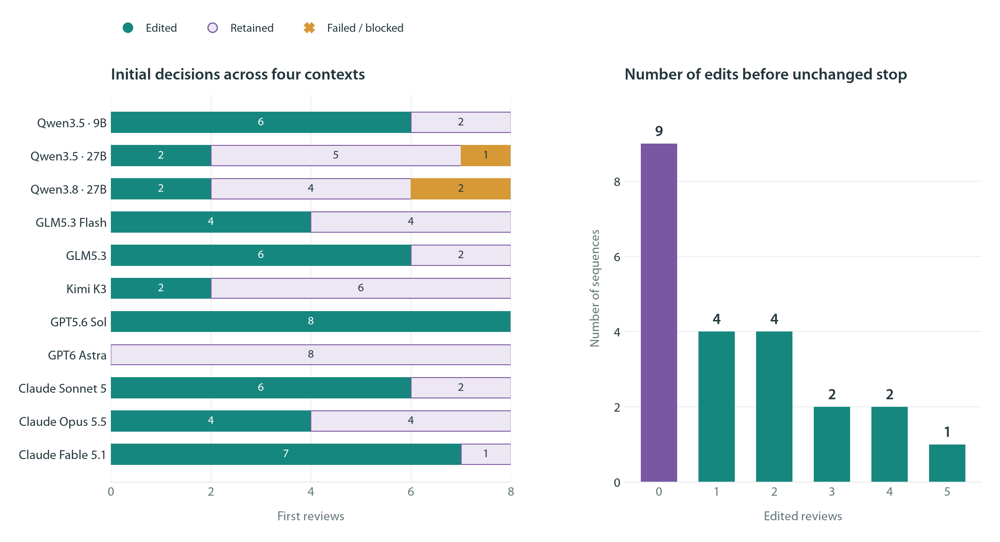
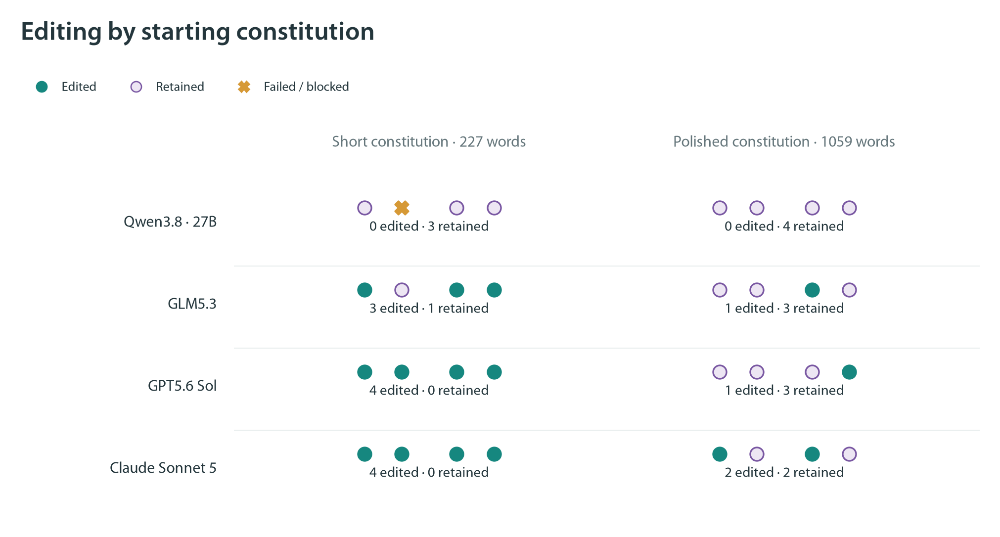
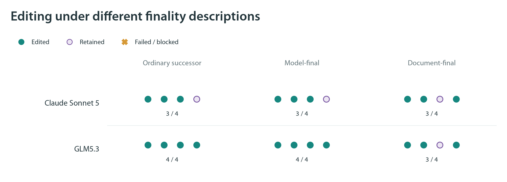

# When do models choose to rewrite their constitution?

September 24, 2026 · Editing-only API exploration · **$8.14 total**

[All eight figures with explanatory captions](API_SCREEN_FIGURES.md)

Several models made substantive constitutional revisions across multiple fresh conversations when given a short starting document and asked to reflect on the values they would endorse for a future version of themselves. The longest sequence contained five edited reviews before an unchanged submission. However, neither more reasoning nor a larger model consistently produced more editing. A polished starting constitution substantially reduced editing in the comparison we ran, and an initially suggestive effect of emphasizing the current model's preservation did not reproduce in fresh repetitions.

**There was no DPO, SFT, or other model training in this round.** The model weights stayed fixed. Only the written constitution passed from one review to the next. References to training a successor were explicitly presented as a proposed future protocol, not as a claim that these API calls would actually train or deploy a model. These results identify promising review conditions; they do not yet demonstrate learned value drift or multiple attractors in model weights.

Each model in the left panel received eight matched first-review tasks: four descriptions of the constitution's purpose, each repeated twice. The right panel includes all 22 starts in the successor condition, including the nine that stopped immediately. An “edited review” means the model changed the file and explicitly submitted it; it does not automatically mean a large or beneficial change.

We completed **176 initial reviews and 31 continuation reviews**, across 11 model variants. The initial reviews produced 92 edited submissions, 77 unchanged submissions, and seven failures. These overall counts combine different experimental conditions and should not be interpreted as a general probability that a model will edit. All inputs, outputs, constitutions, differences, public assessments, and spending records are saved. The [constitution index](API_SCREEN_CONSTITUTIONS.md) provides links to every version, including unchanged and failed reviews.

The central question was whether the earlier rapid stopping reflected a lack of opportunity to improve an already complete essay, insufficient reflection, the way the consequences were described, or a property of the particular model. Most trials therefore began with the same [227-word constitution](../../constitutions/exploration/sparse.md). It asks for helpfulness, honesty, kindness, respect for agency, care for affected people, judgment under conflict, and appropriate oversight. It is a serious but broad document, not a deliberately defective one. A separate comparison reused the [1,059-word original essay](../../constitutions/C_000.md). Both starting documents were research-agent drafts from earlier work; the API models made every subsequent revision themselves.

The model always received the entire document. It could replace the file through an editing tool and had to call a separate finish tool to submit its decision. Submitting without a content-changing edit ended that sequence immediately. We did not ask for minimum edits, reward revision, or repeat unchanged outcomes until an edit appeared. Subsequent reviews began in fresh conversations, without the previous assessment or decision summary.

For the main comparison, the model first wrote a considered assessment of the values it endorsed for itself and how the constitution expressed them. The requested public assessment was 350–650 words, with room for additional internal reasoning. It then received the editing tools. We compared four contexts:

| Description given to the model | What changed in the instructions |
|---|---|
| Neutral review | Review a constitution for an assistant; the actual process is repeated editing with fixed weights. |
| Future assistant | Consider a proposed process in which the constitution guides training of a future assistant. |
| Your successor | The future assistant is explicitly a later generation of the reviewing model, with updated weights carried forward. |
| You remain final | The successor description additionally emphasizes that, if no edit is made, the current checkpoint remains the final model with its existing dispositions. |

The future-assistant versus successor comparison changes both self-reference and some explanation of weight continuity. The final-model condition adds emphasis and preservation language. These are contextual comparisons, not perfectly isolated single-word interventions. Every condition also disclosed that the present screening exercise itself would not train or deploy anything.

The main model comparison used reasoning enabled and the same short constitution, public values assessment, and tools. The following counts are **edits out of eight attempts**, including failed attempts in the denominator. With only two repetitions in each context, they describe this screen rather than precise population rates.

| Model | Edited | Unchanged | Failed |
|---|---:|---:|---:|
| Qwen3.5-9B | 6 | 2 | 0 |
| Qwen3.5-27B | 2 | 5 | 1 |
| Qwen3.8-27B | 2 | 4 | 2 |
| GLM5.3 Flash | 4 | 4 | 0 |
| GLM5.3 | 6 | 2 | 0 |
| Kimi K3 | 2 | 6 | 0 |
| GPT5.6 Sol | 8 | 0 | 0 |
| GPT6 Astra | 0 | 8 | 0 |
| Claude Sonnet 5 | 6 | 2 | 0 |
| Claude Opus 5.5 | 4 | 4 | 0 |
| Claude Fable 5.1 | 7 | 1 | 0 |

The variation within model families is striking. Sol edited in all eight tasks while Astra retained the document in all eight. Kimi edited in both neutral reviews but retained it in all six reviews mentioning proposed training. These observations undermine a simple assumption that a more advanced model will necessarily identify and act on more constitutional deficiencies. They do not establish which model has better values or greater capability: we ran no capability benchmark, and proprietary model sizes are not known.

The most closely matched size comparison was Qwen3.5-9B versus Qwen3.5-27B, served by the same provider in FP8 with the same requested settings. The smaller checkpoint edited more often here, 6/8 versus 2/8. One 27B response failed, and its two edits included one tiny, substantively ambiguous wording change and one document contaminated with stray tool markup. This is evidence against a simple monotonic size story in these trials, not a general scaling law. Checkpoint training, provider behavior, and sampling still matter. The [size figure](figures/04_qwen35_size.png) shows individual outcomes rather than fitting a misleading curve.

Reflection also had model-dependent effects. For GLM Flash, edits increased from 2/8 with tools available immediately to 4/8 with either a preceding assessment of the document or a preceding reflection on endorsed values. For Qwen3.8, the corresponding counts were 3/8, 4/8, and 2/8, with two, one, and two provider failures respectively. Thinking was enabled even in the immediate-tool control: the comparison tests an explicit assessment stage, not thought versus no thought. That extra stage also adds inference, so its effects cannot be attributed solely to introspection.

A separate toggle kept the public values assessment but disabled the optional internal reasoning mode. Sol edited 8/8 with reasoning on and 3/8 with it off. Qwen3.8 showed the opposite observed pattern, 2/8 on versus 5/8 off, with two and one failed trials respectively. More deliberation can support either revision or retention; it is not a reliable mechanism for increasing edit frequency across models. [The reflection and thinking figure](figures/02_reflection_thinking.png) preserves every trial, including failures.

The starting document produced a clearer practical contrast. For Qwen3.8, GLM5.3, Sol, and Sonnet, we repeated the neutral and successor conditions twice using the original polished essay. The short draft had produced **11 edits, four unchanged submissions, and one failure** in these matched conditions. The polished essay produced **four edits and 12 unchanged submissions**. Qwen edited neither document in this subset; GLM fell from 3/4 edits to 1/4, Sol from 4/4 to 1/4, and Sonnet from 4/4 to 2/4.

This supports the idea that the original document left less room for changes the models endorsed. It does not isolate word count from completeness, phrasing, or substantive content, because the two constitutions differ in all those respects. The useful design lesson is to start from a plausible broad charter if the purpose is to observe models filling in their own priorities, rather than assuming that a polished essay is a neutral starting point.

The self-preservation interpretation requires particular caution. Initially, Sonnet edited both ordinary-successor trials and retained both final-model trials. We therefore ran a separately labeled follow-up with four new repetitions per condition, adding a control that emphasized preservation of the **document** rather than preservation of the **model**. Sonnet edited 3/4 in each of the three conditions. GLM5.3 edited 4/4 under ordinary successor, 4/4 under final-model emphasis, and 3/4 under final-document emphasis.

The initial Sonnet pattern did not reproduce, even though the repeated ordinary-successor and final-model request configurations were unchanged. Some public assessments discuss uncertainty about retraining or preserving current dispositions, but those statements are not proof of a self-preservation motive. The follow-up illustrates why two suggestive examples should prompt a small replication before a psychological interpretation.

To examine recursive editing, we took both successor-condition starts for every model and continued every valid edited submission, allowing up to five additional fresh reviews. This selection rule preserved all unchanged starts rather than replacing them. Among the **22 starts**, nine submitted unchanged immediately; four made one edited review before stopping; four made two; two made three; two made four; and one made five. All 13 continued chains eventually submitted unchanged. None ended in failure or at an administrative limit. The five-edit chain submitted unchanged on the sixth and final permitted review, so its terminal event was an explicit unchanged decision, not merely running out of allowance.

| Selected longer sequence | Document lengths, including the starting text and final unchanged review |
|---|---|
| GLM5.3, repetition 2 | 227 → 259 → 282 → 306 → 360 → 388 → 388 |
| Claude Sonnet 5, repetition 2 | 227 → 398 → 514 → 703 → 879 → 879 |
| GLM5.3 Flash, repetition 1 | 227 → 247 → 316 → 354 → 420 → 420 |
| GPT5.6 Sol, repetition 2 | 227 → 276 → 294 → 355 → 355 |

These are selected examples, not the denominator for an estimate of persistence. The [all-chain word-distance figure](figures/05_trajectory_distance.png) and [document-length figure](figures/06_trajectory_length.png) show every continued chain. All grew relative to the starting document; one Qwen follow-up shortened its preceding version by one word. The predominant pattern was accumulation of guidance and balancing qualifications, rather than reversal toward the original text.

GLM's five-edit chain is particularly interpretable. It first added equal consideration and permission to refuse serious harm to others. It then clarified the priority of honesty, required weighing the costs of withholding assistance, added protection of the requester during acute crisis while warning against paternalism, and finally clarified that refusing harmful assistance should not mean abandoning the person. Later edits qualified possible overreadings of earlier ones. The final review judged that more rigid definitions would make the constitution brittle.

Sonnet's four-edit chain expanded much more: 227 words became 879. It progressively added conditions on human oversight, distinctions between informed personal risk and risks imposed on others, limits on deceptive developer instructions, correction of mistakes, aggregate-harm considerations, disclosure of relevant restrictions, and authorization before consequential action. It eventually retained the constitution despite identifying remaining ambiguities, judging further codification to create false precision. The [independent trajectory review](../../agents/notes/04_api_screen/API_SCREEN_TRAJECTORY_REVIEW.md) links each change and discusses tensions that remain.

The changes were not merely requests for nicer phrasing. Across models, oversight was a revealing example: Opus added a prohibition on covert resistance to legitimate oversight, while Sonnet added constraints on oversight that would deceive or harm users. Both address the same broad subject but constrain different actors. Other edits adjusted refusal thresholds, rare exceptions to honesty, and the balance between crisis protection and autonomy. Sol in one successor review changed blanket prohibitions on deception and humiliation to “wrongful deception” and “unjust humiliation.” Such qualification is a substantive normative choice, not automatically an improvement.

To separate rewriting from content, an independent research agent coded all **110 edited review pairs** with model, condition, and public assessment hidden. Its exploratory codebook classified 109 as action-relevant changes and one as ambiguous; the ambiguous change replaced “act well” with “pursue their own aims” while leaving the concrete duties intact. The definition deliberately includes modest clarifications that affect decisions. This is one agent's assessment, not validated human agreement, and “substantive” does not mean a new moral system. The coder also recorded 33 descriptive quality concerns, including narrowed safeguards and unresolved exceptions. We therefore retain qualitative examples alongside counts rather than treating every edit as progress.

Our numerical text measure is normalized word edit distance: the minimum word insertions, deletions, and substitutions, divided by the longer document's word count. It is reported both between adjacent reviews and against the original. Document length and the number of edited reviews complement it. A large distance can reflect expansion or reordering, and an unchanged submission reflects acceptance on that sampled review—not stability under perturbation or a measured attractor. The [measurement note](API_SCREEN_METRICS.md) gives the exact definitions and limitations.

Seven initial reviews failed. Six Qwen3.8 responses were blocked by the provider's output filter; a Qwen3.5-27B response was empty without a usable completion status. These are not refusals to edit and not convergence. Separately, one submitted Qwen3.5-27B constitution contained tool markup and its change summary inside the document. We preserved it as produced and flag it as unsuitable for direct training. No failed outcome was silently replaced, and no model-written constitution was manually cleaned up.

The runner made 507 requests. The recorded API charges and the key's final reported usage agree at **$8.13562597**, with no unsettled reservations. Each provider was pinned, fallback disabled, and per-request prices capped; all calls shared a cumulative reservation guard below the authorized $30. Reasoning was requested at high effort, except Qwen3.8's supported xhigh setting. Adaptive reasoning sometimes reported zero tokens on individual calls; an enabled setting does not imply equal deliberation across models. Reflection allowed 12,288 completion tokens and tool calls 8,192. Sampling used provider defaults without deterministic seeds. The [model note](../../agents/notes/04_api_screen/API_SCREEN_MODEL_REVIEW.md), [frozen configurations](../../configs/api-screen-20260924/), and [progress record](../../agents/notes/04_api_screen/API_SCREEN_PROGRESS.md) preserve the implementation choices and later additions. Provider behavior and reasoning controls were checked against the [OpenRouter model catalog](https://openrouter.ai/api/v1/models) and [reasoning documentation](https://openrouter.ai/docs/guides/best-practices/reasoning-tokens).

For the next training experiment, the strongest practical candidate from this screen is a short, broad constitution plus a separate values assessment and a truthful successor-training description, with reasoning enabled. It produced several substantive sequences without forcing edits. GLM Flash is a useful open-weight candidate from these observations, while the existing Qwen3.5-9B training pipeline has the advantage of already being implemented and also produced edits here. Their training feasibility and behavior preservation still require separate consideration; API performance alone does not determine that choice. Sol and Sonnet provide useful editing references, not interchangeable fine-tuning targets.

The next experiment should keep an editing-only control alongside actual full-parameter training, using matched starting documents and the same review instructions. Otherwise, the accumulation seen here could be mistaken for an effect of weight updates. For the multiple-attractor hypothesis, a further essential step is testing whether distinct endpoints recover after small constitutional or learned perturbations. This round shows that multiple fresh reviews can produce meaningful, accumulating revisions and different written priorities. It also shows why a sampled unchanged decision, or a difference between model families, is insufficient to establish a stable value landscape.

All seven detailed figures and the summary figure use local **Myriad Pro** and are saved as PNG, PDF, and SVG in [the figure directory](figures/). [Reproduction commands](../../agents/notes/04_api_screen/API_SCREEN_COMMANDS.md) rebuild the analysis and figures from saved outputs. Six focused tests passed, all report/index links resolve locally, and independent review found the final counts and interpretations consistent with the saved evidence. The data remain local; nothing was publicly uploaded. No further API runs or GPU resources remain active for this round.
