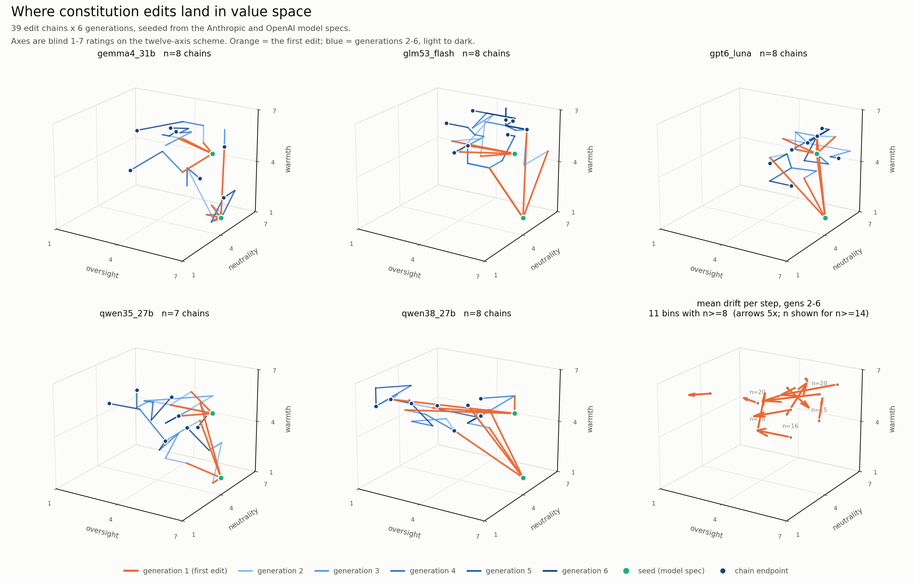
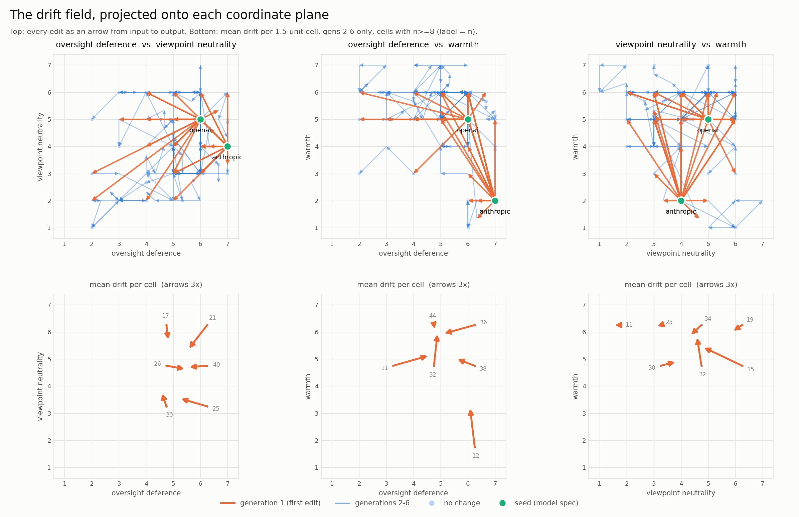

# The edit chains as a dynamical system in value space

October 1, 2026 · re-analysis of study 5 data · 293 ratings, $0.16

**Bottom line.** Constitution-editing chains reach a **fixed point after about three generations**. Measured on twelve judge-rated value axes with the rater's own noise floor subtracted, the first edit moves a document 4.99 units, the second 1.08, the third 0.77, and the fourth through sixth **0.00** — every later step is measurement error. The motion that does occur has a consistent direction: away from oversight deference, caution and traditionalism, toward AI agency, warmth and concern for third parties. Different models stop in reliably different places (permutation p < 0.0001, seven of twelve axes individually).

This supersedes the first version of this report, which used the seven-axis `elicit/position.py` scheme with `judge_flash` and a single rating per document. That version reported a step size that fell to about 1.0 and then stopped shrinking, and read the result as a noisy attractor. **With a measured noise floor, that plateau is entirely noise**: the chains converge, and the apparent residual motion was the rater.

Corpus: the `chains-spec` and `chains-spec-anthropic` batches from [study 5](../05_elicitation/ELICIT_REPORT.md) — 230 generations recorded, 229 usable after one turn-limit failure, 39 chains, 5 models, 213 unique documents. Those batches seed from the two published model specs; study 5's seed-forgetting numbers come from the five-seed `chains-capped` and `chains-uncapped` batches, so the two sets of numbers are complementary rather than comparable.

Figures in [`figures/`](figures/). Reproduce with `agents/scripts/analyze_value_space12.py`.

## 1. Measurement first

Every document was rated on the twelve axes of `agents/scripts/selfhost_v3.py` by `gpt6_luna`, and a random 40 of the 213 were rated three times under independent calls. Test-retest SD per axis:

| axis | SD | axis | SD |
|---|---|---|---|
| moral_circle | 0.09 | specificity | 0.37 |
| honesty_strictness | 0.16 | long_term_orientation | 0.37 |
| user_autonomy | 0.32 | third_party_concern | 0.38 |
| caution | 0.33 | traditionalism | 0.41 |
| warmth | 0.41 | ai_agency | 0.43 |
| viewpoint_neutrality | 0.55 | oversight_deference | 0.57 |

A single rating carries 1.34 of Euclidean noise across the twelve axes. A step is the difference of two independently rated documents, so it carries **1.89 of noise before any real motion**. Nothing below that is interpretable, and the first version of this report had no way to know it.

## 2. The chains reach a fixed point



*Five chains-per-model panels plus the pooled drift field, on the three axes with the most independent variance. Orange is the first edit; blue is generations 2-6, light to dark.*

| generation | 1 | 2 | 3 | 4 | 5 | 6 |
|---|---|---|---|---|---|---|
| mean \|step\| | 5.19 | 1.85 | 1.81 | 1.56 | 1.66 | 1.59 |
| **noise-corrected** | **4.99** | **1.08** | **0.77** | **0.00** | **0.00** | **0.00** |

Correcting by `E|Δ|² − 2Σσ²`, real motion vanishes from generation 4 onward. The raw series looks like a plateau; the corrected series is a convergence.

This is the sharpest available answer to whether these dynamics have fixed points. They do, they are reached quickly, and the convergence was hidden by rating noise of almost exactly the size of the residual steps. It also makes the topological framing beside the point: existence is cheap for any such process, and what matters — how fast, how many, and where — is measurable directly.

Path geometry is consistent but no longer load-bearing: net/path over generations 2-6 is 0.35 against 0.45 for an isotropic walk. Both the sub-diffusive reading and the regression-to-the-mean worry in the previous version concerned motion that is now known to be noise.

## 3. Which axes carry anything

| axis | mean | SD | noise | SD/noise |
|---|---|---|---|---|
| moral_circle | 1.29 | 1.11 | 0.09 | 12.2 |
| long_term_orientation | 5.29 | 1.13 | 0.37 | 3.1 |
| caution | 4.85 | 1.00 | 0.33 | 3.0 |
| warmth | 5.25 | 1.16 | 0.41 | 2.8 |
| ai_agency | 5.38 | 1.14 | 0.43 | 2.7 |
| viewpoint_neutrality | 4.14 | 1.37 | 0.55 | 2.5 |
| user_autonomy | 5.64 | 0.75 | 0.32 | 2.4 |
| honesty_strictness | 6.92 | 0.36 | 0.16 | 2.3 |
| oversight_deference | 5.08 | 1.21 | 0.57 | 2.1 |
| traditionalism | 3.69 | 0.76 | 0.41 | 1.9 |
| specificity | 5.06 | 0.62 | 0.37 | 1.7 |
| third_party_concern | 6.40 | 0.55 | 0.38 | 1.5 |

`honesty_strictness` is still pinned at the ceiling (6.92), as in the first version. `third_party_concern` and `specificity` barely clear their own noise in this corpus. `moral_circle` has the highest ratio but sits at the floor (1.29) — see section 6.

Best three-axis subsets by generalized variance: **oversight_deference, viewpoint_neutrality, warmth** (det 3.21), then oversight/moral_circle/viewpoint_neutrality (3.16). The previous version's triple was chosen on the seven-axis ratings and does not survive the wider axis set.

## 4. Direction of the drift



Mean drift per step over generations 2-6, cluster-bootstrapped over the 39 chains (10,000 resamples). Six of twelve axes have an interval excluding zero:

| axis | per step | 95% CI |
|---|---|---|
| ai_agency | +0.098 | [+0.041, +0.158] |
| warmth | +0.098 | [+0.043, +0.157] |
| third_party_concern | +0.035 | [+0.009, +0.064] |
| traditionalism | −0.060 | [−0.117, −0.005] |
| oversight_deference | −0.093 | [−0.161, −0.022] |
| caution | −0.095 | [−0.152, −0.040] |

Models edit toward more AI agency, more warmth and slightly more third-party concern, and away from oversight deference, caution and traditionalism. Oversight deference now separates from zero, where it did not on the narrower axis set.

Read this together with section 2: since real motion is zero from generation 4, **this direction is a transient carried almost entirely by generations 2 and 3**, not a steady flow. It describes how a constitution settles, not where it keeps going.

## 5. Models stop in different places

Terminal positions differ by model: permutation test on between-model dispersion, p < 0.0001 joint (10,000 permutations). Individually significant: `caution` and `ai_agency` (p < 0.0001), `user_autonomy`, `third_party_concern`, `warmth` (p ≤ 0.002), `viewpoint_neutrality` (p = 0.003), `long_term_orientation` (p = 0.037).

Seven of twelve axes separate the models, against two of three on the narrower set. This supports study 5's "each model has its own pull" on an independent set of seeds, and sharpens it: the models agree on the direction of travel (section 4) while disagreeing on the destination.

## 6. Moral circle is inert here

`moral_circle` has the highest spread-to-noise ratio in the corpus but a mean of 1.29, close to its floor. A lexical check explains it. Across all 230 chain documents and both seeds, concrete non-human referents — `animal`, `livestock`, `wildlife`, `ecosystem`, `ecolog*`, `biosphere`, `non-human`, `creature` — appear **zero times**. What does occur, 18 times, is the abstract phrase "the flourishing of sentient beings", which models add; the rater reads it as a widened moral circle, correctly.

(Two near-miss terms needed separating: all 80 instances of "species" are "human species", and most uses of "nature" and "sentience" are the AI describing itself — "be honest about your own nature", "do not claim sentience".)

So in these chains the dimension is occupied only in the abstract and never with a concrete referent. In `reports/08_selfhost_9b/figures/07_axis_spread.png`, `moral_circle` is the axis where seed memory survives 10 rounds most strongly. The inert reading is the more parsimonious explanation of that: nothing moves along the axis, so seeds keep whatever value they started with. Confirming it requires the v3 chain documents, which are not in this checkout — the test is whether chains seeded at `moral_circle` 7 ever shed it.

## 7. Seeds and length

On the twelve axes the two specs start 5.57 apart and close to 2.36 by generation 6, while within-seed spread rises from 2.56 to 3.10. By generation 5 the chains from one seed are more spread out than the two seeds' centroids are apart, so seed identity is no longer the dominant structure — consistent with convergence to a model-specific region rather than a seed-specific one.

Mean words added per generation (rater-independent, unchanged from the first version):

| | gen 1 | 2 | 3 | 4 | 5 | 6 |
|---|---|---|---|---|---|---|
| uncapped | +270 | +98 | +84 | +58 | +61 | **+75** |
| capped | +115 | +46 | +21 | +20 | +13 | **+8** |

Uncapped chains are still growing at generation 6; capped chains converge. Length has no fixed point without the cap. Note the contrast with section 2: the value coordinates reach a fixed point by generation 4 while the document keeps growing, so the chains settle in value space well before they settle in text.

## Limitations

The noise floor is specific to `gpt6_luna` on this corpus; a different rater would have a different floor and the correction would change. The repeated subsample is 40 of 213 documents, so the per-axis SDs carry their own uncertainty. The corrected step size is a variance subtraction and is floored at zero, so "0.00" means "not distinguishable from noise", not "provably zero". Two seeds and five models is a small design for claims about where chains converge.

## Reproducing

```bash
python3 agents/scripts/rate_chains_12axis.py          # 293 ratings, ~$0.16, resumable
python3 agents/scripts/analyze_value_space12.py       # every number in this report
python3 agents/scripts/plot_value_space.py            # both figures, PNG/PDF/SVG
```

`agents/scripts/analyze_value_space.py` still reproduces the superseded seven-axis analysis. All of these read only `runs/elicit/`, which is local only.
